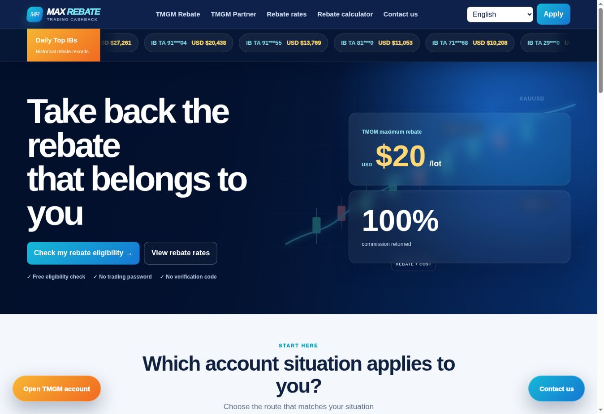

# Max Rebate / 满返网

**Understand first. Then decide whether to apply.**

Max Rebate makes trading account and rebate information easier to understand, with clear comparisons and human onboarding support. It brings scattered account types, spreads, rebate rates, and eligibility guidance into one place, currently focused on TMGM.

**[Visit max-rebate.com →](https://max-rebate.com/)**

*“100%” means the eligible client rebate actually received and returnable, not all trading costs. Rates remain subject to account and platform conditions.*

## A clearer path to getting started

**Understand → Compare → Check eligibility → Apply → Human onboarding**

**Compare accounts.** See account types, reference spreads, fees, and rebate rates for gold, forex, and Bitcoin side by side.

**Estimate rebates.** Choose an account type and lot size in the gold calculator. Estimates exclude spreads, slippage, and overnight fees; they are not a measure of total costs or profit.

**Find your next step.** Separate routes guide new clients, existing account holders, and Introducing Broker (IB) applicants, with application support and human follow-up.

Available in English, Simplified Chinese, Traditional Chinese, Malay, and Thai.

## Before you apply

Rates, eligibility, and settlement depend on account conditions, eligible trades, platform records, and review. Applications do not guarantee approval or rebates.

Max Rebate is independent, not TMGM’s official website, and provides no personal investment advice. Leveraged trading is high risk; rebates do not reduce market risk or guarantee profit. Never submit passwords, verification codes, bank-card details, or identity-document images.

[Terms of use](https://max-rebate.com/terms.html) · [Risk disclaimer](https://max-rebate.com/risk-disclaimer.html)

Built with HTML, CSS, and JavaScript.
